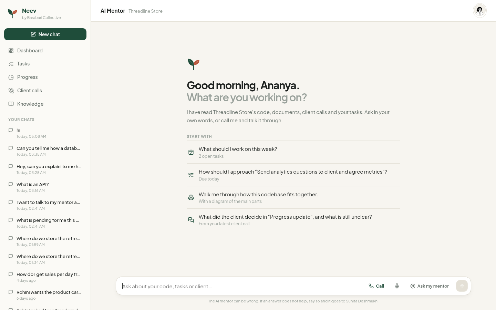
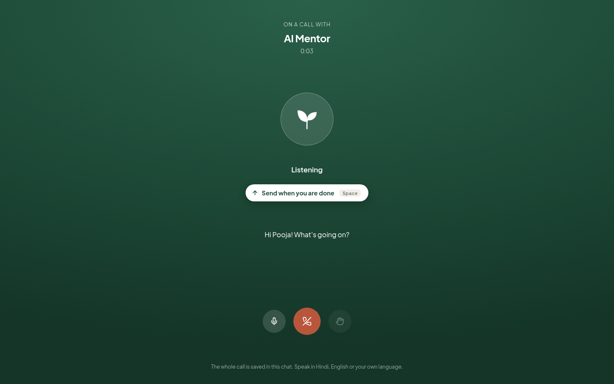
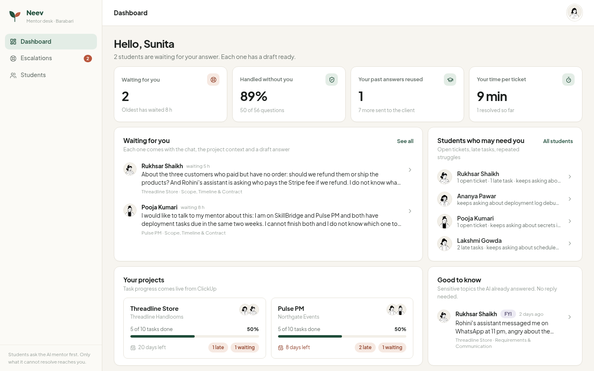
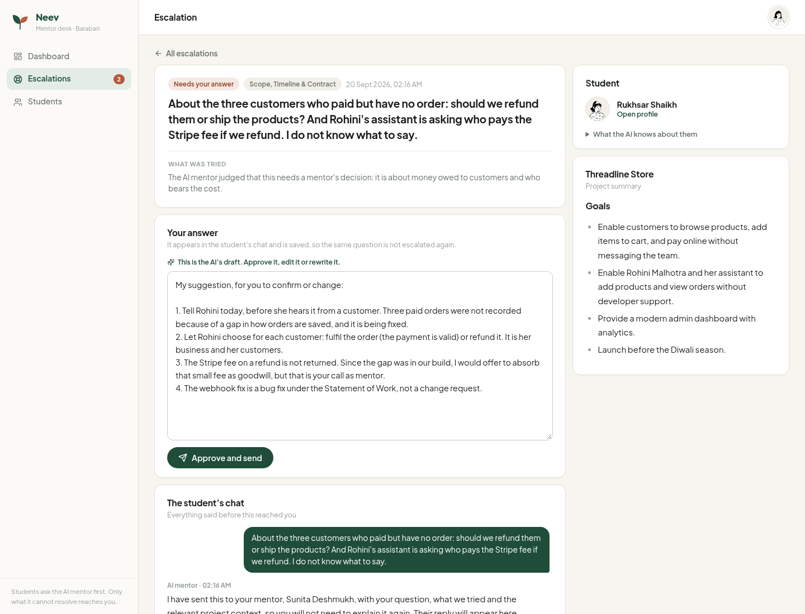
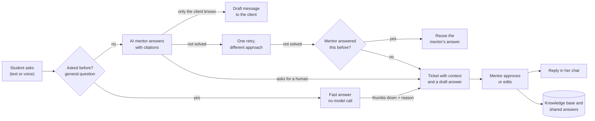
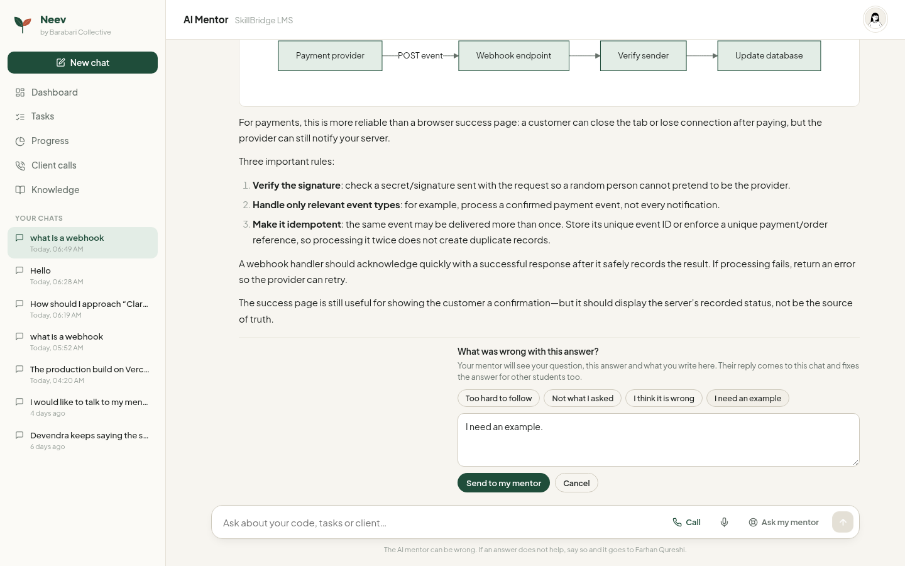
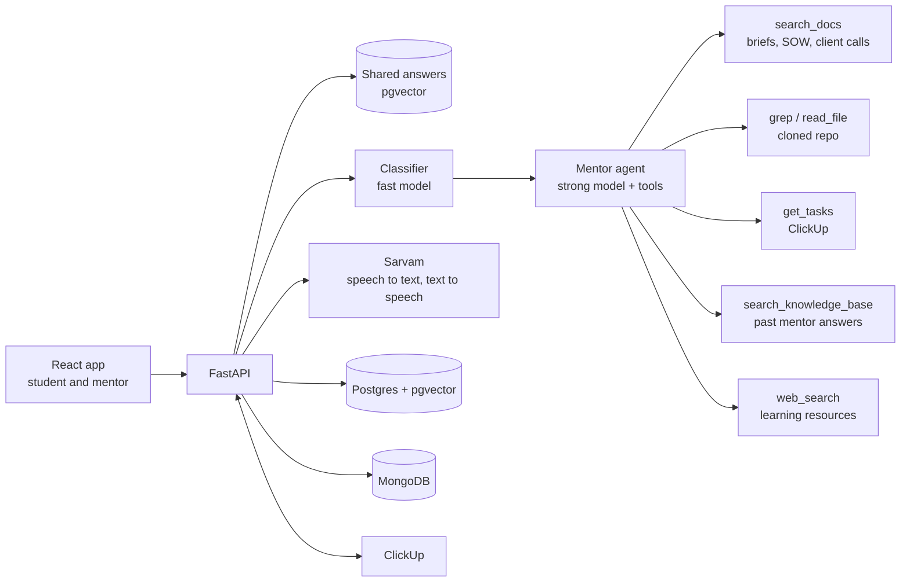

<p align="center">
  
</p>

<h1 align="center">Project Saathi</h1>

<p align="center">
  An AI mentor that knows each student's client project, and hands a question to the human mentor only when it should.<br>
  Built for <a href="https://barabaricollective.org/">Barabari Collective</a> · Team 21 · JPMorganChase Code for Good 2026, Hyderabad · Challenge 2 (Mentoring)
</p>

---

## The problem

Barabari Collective places graduates from low-income communities on real freelance projects for
external clients, with a senior mentor behind each project. It works, but it does not scale:

- Students go to mentors for routine questions, by ticket, chat and call.
- Client requirements get misread, which causes rework and delays.
- Mentors re-explain the same project context again and again, across students and projects.
- Mentor time goes to debugging and deployments instead of scoping and architecture.
- Progress and open issues are visible only through periodic manual follow-ups.

The challenge asks: how might students work more independently, and understand and communicate
client requirements better, while mentors spend their time where it is most needed?

## What we built

A student asks Project Saathi first, by typing or by calling it. It has read her project: the
code, the brief and statement of work, the client call transcripts, and her ClickUp tasks. It
knows her strengths and weak areas from her CodeGuru and Samvad Saathi scores. It guides rather
than solves, and shows where each project fact came from.

When the AI cannot or should not answer, the question reaches her mentor as a ticket that is
already prepared: the question, what was tried, the project context and a draft answer. The
mentor approves or edits it, usually in minutes. That answer goes back into her chat and into a
knowledge base, so the same question never reaches a mentor twice.

| Student: a chat that starts from her own week | Student: a voice call |
|---|---|
|  |  |

| Mentor: what needs you, and who may be struggling | Mentor: a ticket arrives with context and a draft |
|---|---|
|  |  |

## How it solves the problem

The challenge statement lists six considerations. This is how each one is met.

| Consideration | What Project Saathi does |
|---|---|
| **Student independence** | Guides, does not solve: explains the approach, shows short snippets in the project's stack, draws diagrams, links learning resources found by web search. Pitches the explanation to her level, step by step in a weak domain and brief in a strong one. Records recurring struggle topics so both she and her mentor can see them. |
| **Context-aware support** | Every answer is built from her project: a project card always in the prompt, hybrid search over documents and client call transcripts, live reading of the actual repository (`grep`, `read_file`), and her ClickUp tasks and deadlines. Six specialists by question type: requirements, scope and contract, architecture, debugging, deployment, Git. |
| **Reliable information** | Project facts must come from a tool result, and each carries a citation that opens the file, document or call. Citations and links the model did not actually see are removed in code. If the project material does not contain the fact, it says so instead of guessing. |
| **Human in the loop** | An escalation sequence: answer, then one retry with a different approach, then a past mentor answer if one matches, then a ticket. "I want to talk to my mentor" escalates at once. Sensitive topics (money, scope changes, credentials) are answered and also sent to the mentor as an FYI that needs no reply. |
| **Client communication** | When only the client can know the answer, the AI does not guess: it drafts a short, polite message with two or three concrete options for her to send, and explains why it is worded that way. It reads the client call transcripts, so "what did the client decide?" has a cited answer. Scope creep gets a factual change-request reply. |
| **Scalability** | Mentors see only what the AI could not resolve, with the work half done. Every mentor answer is reused. General questions are answered once and then served to every later student in under a second. Details below. |

### The escalation sequence



### Features

**For students**
- Chat grounded in her code, documents, client calls and tasks, with readable sources
- **Voice call** with the AI mentor: she talks and taps Send when she is done, in Hindi, English or her own language, with
  short spoken answers like a phone call; plus voice messages and a Listen button on any answer
- Mermaid diagrams, syntax-highlighted code, draft client messages with one-click copy
- Dashboard of what to do next, project and task views, client call summaries, knowledge base
- A profile showing her scores and what the AI remembers about her

**For mentors**
- Dashboard: who is waiting and for how long, share of questions handled without them, students
  who may need them (open tickets, late tasks, repeated struggles), project progress from ClickUp
- Tickets that arrive with the full chat, project summary, what was tried and an AI draft:
  approve, edit or rewrite
- Per-student view: scores, struggles, chats with the tools the AI used, and an editable AI memory
- FYIs for sensitive topics, which need no reply

**For Barabari**
- Fits the existing workflow: tasks are read from ClickUp, and each escalation becomes a task in
  a ClickUp "Mentor support" list that closes when the mentor answers
- Metrics: deflection rate, mentor minutes per ticket, retries, questions redirected to the
  client, answers reused

## Impact

What changes for each stakeholder:

| Who | Before | With Project Saathi |
|---|---|---|
| Students | Wait for a mentor, even for routine questions | A grounded answer in 10 to 20 seconds, at any hour, by text or voice, in their language. They learn the method, not just the fix. |
| Mentors | Re-learn the context for every ticket | See only unresolved questions, with context and a draft. Approving a good draft is one click. |
| Clients | Vague questions, misread requirements | Specific questions with options to choose from, and scope changes raised as change requests |
| Barabari team | Progress through manual follow-ups | Live task progress, open issues, and which students are struggling with what |

How it is measured, on the mentor dashboard:

- **Deflection rate**: the share of student questions resolved without a mentor.
- **Mentor minutes per ticket**: from opening a ticket to sending the answer.
- **Answers reused**: questions served from a past mentor answer or a shared answer.

The numbers in the screenshots come from seeded demo data and our own test questions, so they
show how the dashboard reads, not a field result. Real numbers need a pilot with a Barabari
cohort; the metrics are already collected for it. What we did measure is in the next section.

## Scalability

More students must not mean proportionally more mentor time or model cost. Full write-up with
measurements: [`docs/scalability.md`](docs/scalability.md).

- **Mentor time stays flat.** A mentor answers a question once. The same question from anyone,
  later, is answered from the knowledge base instead of opening a ticket.
- **General questions are answered once.** "What is a webhook?" reads the same on every project.
  The first answer is stored with its embedding and served to every later student who asks the
  same thing. Measured: 14 to 17 seconds the first time, 0.5 to 1.3 seconds after, with no model
  call. Two questions count as the same at cosine similarity 0.86 or more; between 0.72 and 0.86
  a small fast-model check decides, and a confirmed rewording is remembered.
- **It improves itself.** Such an answer is marked **Fast**. If a student marks it unhelpful, she
  is asked what was wrong, and the question, answer and her reason go to the mentor. The answer
  is held back until the mentor's corrected version replaces it for everyone.
- **Fast by construction.** The classifier and the searches run in parallel, the repository map
  is already in the prompt, and slow work (repo sync, memory summaries) runs after the reply.
- **Stateless API.** State lives in Postgres and MongoDB, so API workers can be added freely.

<p align="center">
  
</p>

## Architecture



| Layer | Technology |
|---|---|
| Frontend | React 18, Vite, react-router, mermaid, react-markdown with syntax highlighting |
| Backend | Python, FastAPI, SQLAlchemy (async), managed with `uv` |
| Models | Azure OpenAI: a fast model to classify and judge, a strong model to answer; OpenAI embeddings |
| Search | Postgres full-text and pgvector, merged with reciprocal rank fusion |
| Data | Postgres: users, projects, tasks, tickets, knowledge base, shared answers, chunks, metrics. MongoDB: chat sessions, student and project memory, transcripts |
| Voice | Sarvam `saaras:v3` (speech to text, language detected) and `bulbul:v3` (text to speech) |
| Integrations | ClickUp REST (tasks in, support tickets out), GitHub (shallow clones), Exa web search |
| Deploy | EC2 with Caddy (automatic HTTPS) and systemd, in [`deploy/`](deploy/) |

Memory has four levels: the session log, a session summary, a student memory (strengths, weak
domains, struggle topics, what explanation style worked; mentors can edit it) and a project
memory. Decisions and the API contract are in [`docs/design.md`](docs/design.md).

## Run it

Needs Python with [`uv`](https://docs.astral.sh/uv/), Node 18+, and Docker for the local databases.

```sh
cp backend/.env.example backend/.env    # then fill in the keys
make db                                 # local Postgres + MongoDB in Docker
make seed                               # users, projects, briefs, transcripts, tasks
make ingest                             # needs LLM keys: chunks, project cards, repo maps
make demo                               # a fortnight of realistic activity, no model calls
```

Then, in two terminals:

```sh
make dev                                    # API on http://localhost:8000, docs at /docs
cd frontend && npm install && npm run dev   # app on http://localhost:3000
```

The frontend proxies `/api` to the backend, so there is nothing else to configure. Log in by
picking a seeded account: students `s1` to `s5`, mentors `m1` and `m2`, admin `a1`.

| Key in `backend/.env` | Needed for |
|---|---|
| `OPENAI_API_KEY`, `OPENAI_BASE_URL`, `MODEL_FAST`, `MODEL_STRONG`, `EMBEDDING_MODEL` | answers, ingest, search by meaning |
| `SARVAM_API_KEY` | voice. Without it the voice buttons are hidden and the rest works |
| `CLICKUP_TOKEN`, `CLICKUP_ENABLED` | live tasks and support tickets in ClickUp. Without it the seeded tasks are used. `cd backend && uv run python -m scripts.clickup_setup` creates the lists |
| `EXA_API_KEY` | learning resources from web search |

Microphone access needs `localhost` or HTTPS.

### A five-minute demo

Keep a student and a mentor open in two browser profiles.

1. **Student `s1`**: ask about the project ("Customers pay but the order does not show up"). Note
   the sources under the answer.
2. Click **Call** and ask something aloud, in Hindi or English.
3. Ask a general question ("What is a webhook?") as `s1`, then the same in other words as `s3`:
   the second answer is instant and marked **Fast**.
4. Mark an answer "No, try again" twice: the question becomes a ticket.
5. **Mentor `m1`**: open Escalations, review the draft, **Approve and send**. The reply appears
   in the student's chat, and the matching ClickUp task closes.
6. Ask the same question as another student: it is answered from the mentor's answer, with no
   new ticket.

`make demo` also loads ready-made examples of each of these. Everything it writes has an id
starting with `demo_`, and `make demo ARGS=--force` replaces only that. After a `make seed`, run
`make ingest` and then `make demo`.

### Checks

```sh
make check    # 25 checks of the whole flow with a fake LLM; local databases only
make smoke    # the demo path against a running server with real models
```

`make check` covers grounded answers with citation filtering, retry, tickets, mentor resolve,
knowledge base reuse, shared answers served with no model call, the review loop for a rejected
Fast answer, metrics, memory and access control.

## Repository

- `backend/`: FastAPI service
  - `app/agent/`: classifier, prompts, tools, hybrid search, the mentor agent
  - `app/services/`: escalation sequence, tickets and knowledge base, shared answers, sessions, memory
  - `app/integrations/`: ClickUp, Sarvam
  - `app/ingest/`: repo clone, chunking, project card, repo map
  - `app/routers/`: HTTP API
  - `seed_data/`: synthetic projects, students, mentor answers and demo activity
- `frontend/`: React app. Students get `/student`, mentors and admins get `/mentor`.
- `deploy/`: EC2 setup

## Docs

- [`docs/design.md`](docs/design.md): decisions, architecture, API contract, data shapes
- [`docs/scalability.md`](docs/scalability.md): shared answers, the self-improvement loop, measurements, limits
- [`docs/build-log.md`](docs/build-log.md): what was built step by step, what was tested, what was measured
- [`CONTEXT.md`](CONTEXT.md): glossary
- [`docs/project-scope/`](docs/project-scope/): challenge statement, Q&A transcript, sample questions

## What is next

- A pilot with one Barabari cohort to measure real deflection and mentor minutes
- An admin overview across all projects for the Barabari team
- Live help during a client meeting: she types what is unclear, and gets follow-up questions to
  ask before the call ends
- Nudges for late tasks and unanswered client questions, and a voice rehearsal mode for client calls
- Matching students to projects from their scores and attendance
