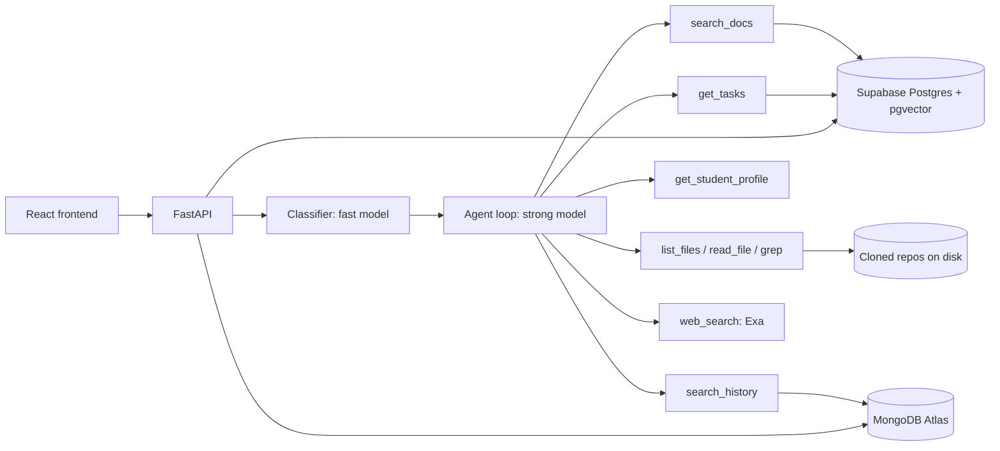

# Design

Backend for an AI mentor that supports Barabari students on freelance client projects.
Terms used here are defined in [`CONTEXT.md`](../CONTEXT.md). The challenge documents are in [`project-scope/`](project-scope/).

## Goal

Reduce mentor time spent on routine questions while students learn to work independently.

KPIs shown on the dashboards:

- **Deflection rate**: share of student questions resolved without a mentor.
- **Mentor minutes per ticket**: time from opening a ticket to sending the answer.

## Scope

Assumed as given: CodeGuru and Samvad Saathi scores per student, and the student-project-mentor assignment.
The React frontend is built by another team against the API below.

| Phase | Features |
|---|---|
| MVP | Grounded chat, category routing, escalation sequence, mentor tickets with draft answers, knowledge base, memory, embeddings, ClickUp over REST, EC2 deploy config |
| After MVP, in order | Voice push-to-talk (Sarvam), nudges, admin overview, voice rehearsal mode, GitHub webhook sync |

## Behaviour rules

1. **Guide, do not solve.** The mentor explains the approach, gives short illustrative snippets in the project's stack, links learning resources and draws mermaid diagrams. It does not write a whole feature.
2. **Adapt to the student.** Weak domain: step-by-step with reasoning. Strong domain: short pointers.
3. **Ground every project claim.** Project facts come from tools, and each one carries a citation. An answer with no citations is labelled general guidance.
4. **Say when something is not in the project context.** Missing requirements become a question for the client, not a guess.
5. **Resources come from web search only.** The model never writes a URL from memory.

## Question categories

1. Requirements and client communication
2. Scope, timeline and contract
3. Architecture, design and planning
4. Development and debugging
5. Deployment, environment and handoff
6. Git and workflow

Each question is also tagged `project_specific` or `generic`. The tag decides whether project tools are used.
One agent handles all categories. The category selects a prompt section and is returned to the UI.

## Escalation sequence

| Step | `next_action` | When |
|---|---|---|
| Answer | `answered` | Default |
| Clarify | `clarify` | The question is too vague to answer |
| Redirect to client | `ask_client` | The missing fact is something only the client knows. Includes `draft_client_message` |
| Retry | `answered` | Student marks the answer not resolved. One retry, stronger model, different approach |
| Escalate | `escalated` | Retry also failed, or the student asks for a human |

Before escalating, the knowledge base is searched. A close match is returned as "your mentor answered a similar question before".

Sensitive topics (scope changes, money, production credentials) are answered with best-practice guidance and also create an **FYI** for the mentor. An FYI needs no reply.

A ticket contains the project card, the question, what was tried, relevant excerpts, the AI's draft answer and a link to the chat session. The mentor approves, edits or rewrites. The final answer goes to the student and into the knowledge base.

## Architecture



- **LLM access** goes through an `LLMClient` interface with two implementations: Responses API and Chat Completions. `LLM_API` selects one. `temperature` is never sent. Output limits use the parameter each API expects.
- **Models**: `MODEL_FAST` classifies and summarises. `MODEL_STRONG` answers, retries and writes project cards. `gpt-5.6-luna` is the fast model and `gpt-5.6-terra` the strong one, both Azure OpenAI deployments.
- **API shape**: Responses API, settled by test. Chat Completions rejects tools combined with reasoning on these models.
- **Latency**: the knowledge base and document searches run while the classifier runs, and the repo map is in the prompt, so most answers need one tool round or none.

### Context strategy

| Source | How the agent sees it |
|---|---|
| Project card (about 500 tokens) | Always in the prompt |
| Student memory, last 10 turns | Always in the prompt |
| Project docs and meeting transcripts | Chunked, hybrid search (Postgres full-text + pgvector) via `search_docs` |
| Code | Shallow clone on disk. Repo map in the prompt on demand, then `list_files`, `read_file`, `grep`. Not embedded |
| Past mentor answers | Knowledge base, embedded, searched before escalation |
| Older sessions | `search_history` over session summaries |

Repos are refreshed with `git fetch` when a session starts and the last sync is older than 10 minutes. Ingest skips `node_modules`, lockfiles, binaries, SQL dumps and files over 200 KB.

### ClickUp

Barabari already tracks projects and support tickets in ClickUp, so the integration keeps that workflow instead of replacing it. REST v2 with a personal token, switched on by `CLICKUP_ENABLED`. The official MCP server was not used: it needs OAuth and allows 50 calls a day on the free plan.

| Direction | Behaviour |
|---|---|
| In | Each project maps to a ClickUp list. Tasks are mirrored into the tasks table, at most once a minute, when the agent's `get_tasks` tool or the project endpoint is used. The table is the fallback, so a ClickUp outage leaves the last synced data in place. |
| Out | An escalated ticket creates a task in the "Mentor support" list with the question, what was tried and the AI's draft. Resolving the ticket adds the mentor's answer as a comment and closes the task. FYIs do not create tasks. |

Two ClickUp behaviours the code accounts for:

- The API rejects a status name the list does not have, and a new space only has `to do` and `complete`. Our other statuses travel as tags; `scripts.clickup_setup` turns those tags into real statuses once the space has them.
- A date-only due date is stored as 4:00 AM in the user's timezone, so it must be read in that timezone, not in UTC.

`python -m scripts.clickup_setup` creates the space and lists, pushes the seeded tasks and saves the ids in MongoDB.

### Memory hierarchy

1. **Session log**: every turn, tool call, category and outcome. Append-only. Mentors can open it from a ticket.
2. **Session summary**: written when a session ends.
3. **Student memory**: strengths, weak domains, recurring struggle topics, what explanation style worked. Seeded from scores. Mentors can edit it.
4. **Project memory**: project card plus a running log of decisions and open client questions.

### Storage split

| Supabase Postgres | MongoDB Atlas |
|---|---|
| users, projects, assignments | session logs |
| student scores | session summaries |
| tickets, FYIs | student and project memory |
| knowledge base entries | meeting transcripts |
| tasks (ClickUp-shaped) | raw project documents |
| chunks with text, tsvector and embedding | repo maps, ClickUp ids |
| metrics events | |

## API

All routes are under `/api`. Auth is a bearer token from `/api/login`. Roles: `student`, `mentor`, `admin`.

| Method | Path | Role | Purpose |
|---|---|---|---|
| POST | `/login` | any | `{user_id}` returns `{token, user}` |
| GET | `/me` | any | Current user with projects |
| GET | `/projects/{id}` | any | Project with card, tasks, meetings |
| POST | `/projects/{id}/sync` | any | Re-fetch the repo |
| POST | `/chat` | student | Ask the mentor |
| POST | `/chat/{message_id}/feedback` | student | `{resolved: bool}`. `false` triggers retry, then escalation |
| GET | `/sessions/{id}` | student, mentor | Session log |
| GET | `/students/{id}/memory` | student, mentor | Student memory as markdown |
| PUT | `/students/{id}/memory` | mentor | Edit student memory |
| GET | `/mentor/tickets` | mentor | Open tickets and FYIs |
| GET | `/mentor/tickets/{id}` | mentor | Ticket with context, draft and chat |
| POST | `/mentor/tickets/{id}/resolve` | mentor | `{answer}` sends it and writes the knowledge base entry |
| GET | `/mentor/metrics` | mentor, admin | Deflection rate, minutes per ticket |

### Chat request and response

```json
{ "project_id": "p1", "session_id": null, "message": "How do I ..." }
```

```json
{
  "session_id": "s_123",
  "message_id": "m_456",
  "category": "development_debugging",
  "scope": "project_specific",
  "next_action": "answered",
  "message": "Markdown. Diagrams are fenced ```mermaid blocks.",
  "citations": [{ "type": "code", "ref": "backend/controllers/auth.controller.js:42", "snippet": "..." }],
  "resources": [{ "title": "...", "url": "...", "why": "..." }],
  "draft_client_message": null,
  "ticket_id": null,
  "grounded": true
}
```

`citations[].type` is one of `code`, `doc`, `meeting`, `task`, `kb`.
The frontend shows the message, a category chip, collapsed sources, up to three resources and one action button. Tool calls and reasoning stay in the session log.

## Demo data

Three public MIT-licensed repos stand in as client projects. Each gets a synthetic client brief, two call transcripts with one deliberately ambiguous requirement, and a task list.

| Project | Repo |
|---|---|
| E-commerce store | `burakorkmez/mern-ecommerce` |
| Learning platform | `elyse502/lms` |
| Project management SaaS | `Parvchaudhary040/pulse` |

Student profiles follow this shape:

```json
{
  "codeguru": {
    "domains": { "frontend": 72, "backend": 55, "database": 48, "devops": 35, "git": 80 },
    "weekly_avg": 68, "monthly_avg": 61, "capstone": 70,
    "attendance_pct": 88, "daily_activity_pct": 74, "portfolio_complete": true
  },
  "samvad_saathi": {
    "knowledge": { "fullstack": 64, "product_design": 50 },
    "speech": { "fluency": 58, "pronunciation": 62, "clarity": 55 },
    "interviews_taken": 6
  }
}
```

## Working agreements

- One branch and one PR per feature. Short descriptions, labels for area.
- `make hooks` installs the pre-commit hook that blocks secrets, keys, archives and large files.
- Secrets live only in `backend/.env`.
- `make smoke` runs the demo path end to end.
